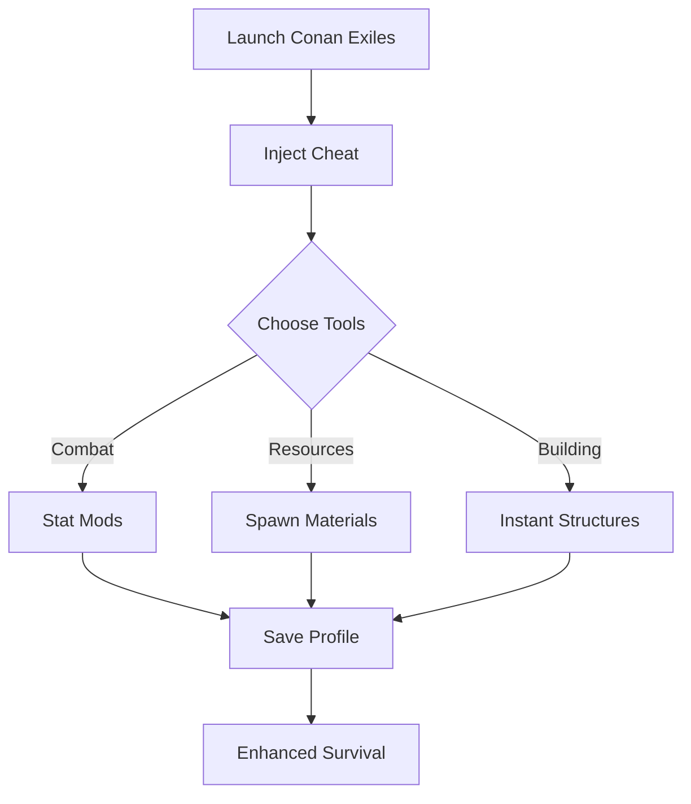

# Conan Exiles Cheat Software for Survival & Domination

The **Conan Exiles Cheat** is built for players who want to master the Exiled Lands without endless grind. From resource farming to combat dominance, this software gives you full command of your character, environment, and progression. Instead of fighting randomness, you can focus on exploration, building, and survival on your own terms.

---

## 🧰 Features

* **Combat Enhancements ⚔️**

  * Infinite stamina, freeze health, one-hit kills.
  * Precision lock for ranged weapons.

* **Resource Tools**

  * Spawn stone, iron, and rare materials instantly.
  * Unlimited encumbrance toggle for smooth farming.

* **Awareness & ESP 👁**

  * Highlight enemy NPCs, bosses, and hidden resources.
  * Radar-style overlay for map-wide awareness.

* **Building Boosts**

  * Instant construction toggle.
  * Unlock recipes and crafting tiers automatically.

* **Custom Configs**

  * Save profiles for PvE farming, base building, or combat training.

[](#)
[](#)
[](#)
[](#)

---

## 🖥 Compatibility

| Platform       | Status         | Notes                                 |
| -------------- | -------------- | ------------------------------------- |
| Windows 10/11  | ✅ Full Support | Works with latest Conan Exiles build. |
| Steam          | ✅ Compatible   | Hook tested with direct injection.    |
| Epic Games     | ⚠️ Partial     | Requires manual file path setup.      |
| Game Pass (PC) | ❌ Unsupported  | UWP restrictions currently block use. |

\[!WARNING]
Cheats are **best used in solo or private servers**. Multiplayer/official servers may detect modifications.

---

## ⚡ Setup

1. Download the cheat package.
2. Place files into your Conan Exiles directory.
3. Launch the game, then run the cheat as Administrator.
4. Assign your hotkeys, e.g.:

```ini
[F1] = Toggle Infinite Health  
[F2] = Add 500 Ironstone  
[F3] = Enable ESP Overlay  
[F4] = One-Hit Kill Mode  
[F5] = Instant Construction  
```

5. Save your configuration for different playstyles.

---

## 📊 Workflow Diagram



---

## ❓ FAQ

**Q: Will this cheat affect my saved worlds?**
A: No—features are session-based unless you save resource changes manually.

**Q: Is it safe on official servers?**
A: No. Cheats are designed for private servers, single-player, or creative testing.

**Q: Can I spawn rare thralls or bosses?**
A: Yes—spawn lists include NPCs, creatures, and legendary enemies.

**Q: Does the ESP overlay impact performance?**
A: Minimal—optimized for DX11 with toggle options for resource or enemy highlights.

**Q: How often is this updated?**
A: After every major Conan Exiles patch or expansion.

---

## 🚀 Final Thoughts

The **Conan Exiles Cheat** is the ultimate toolkit for reshaping survival into strategy. Whether you want instant building, smooth farming, or unstoppable combat, it’s all here—ready to bend the Exiled Lands to your will.

[](#)
[](#)
[](#)
[](#)

---
